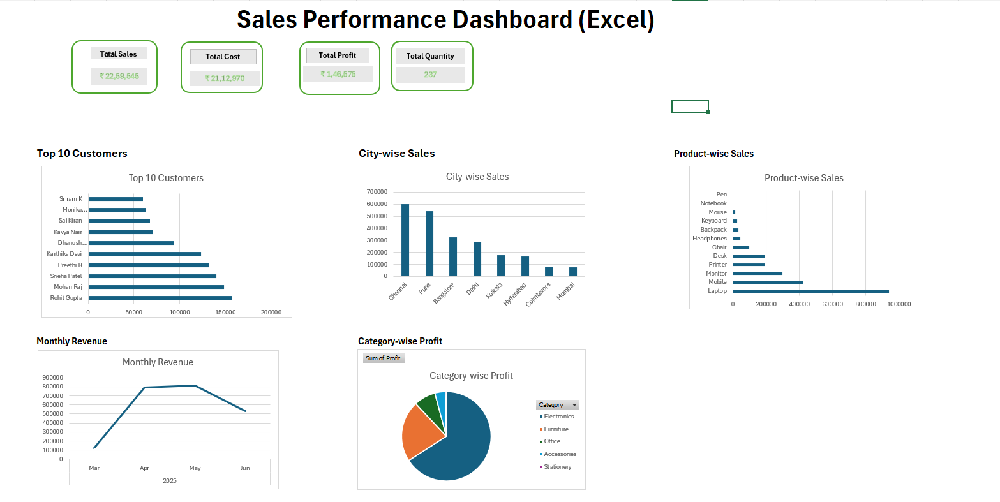

&#x20;                                                          **📊 Sales Performance Dashboard using Microsoft Excel**

**Project Overview:**

Developed an interactive Sales Performance Dashboard using Microsoft Excel to analyze sales data using KPI cards, Pivot Tables, and Pivot Charts.

**Project Objectives:**

- Analyze overall sales performance.
- Monitor key business KPIs.
- Identify top-performing customers.
- Compare sales across cities.
- Track monthly revenue trends.
- Analyze profit by category.

**KPIs:**

* Total Sales
* Total Cost
* Total Profit
* Total Quantity

**Dashboard Preview:**

**Tools Used:**

* Microsoft Excel
* Pivot Tables
* Pivot Charts
* Dashboard Design

**Skills Demonstrated:**

* Data Cleaning
* Data Analysis
* KPI Reporting
* Dashboard Design
* Business Analysis
* Data Visualization

**Business Insights:**

* Laptop generated the highest sales.
* Chennai recorded the highest sales.
* Electronics contributed the highest profit.
* Monthly revenue increased from March to May.
* Stationery products generated the lowest profit.

**Files Included:**

*  Sales_Dataset.xlsx

*  Sales_Performance_Dashboard.xlsx

*  Dashboard.png

**Conclusion:**

This dashboard provides an interactive overview of sales performance by tracking key business metrics and visualizing customer, product, city, revenue, and profit trends. It demonstrates practical Excel skills used in business reporting and data analysis.

**Author**

**Akshaya Priya**

